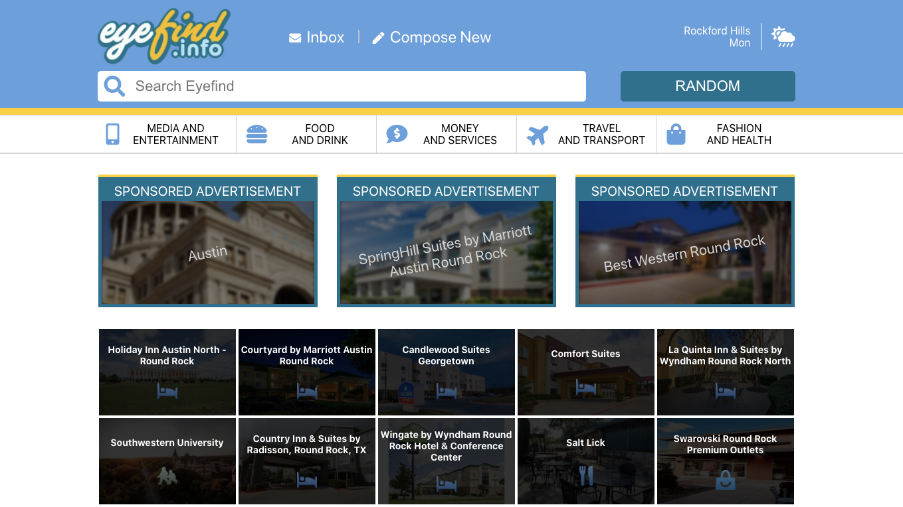

# eyefind.info

## Attempts to create a real world eyefind.info website like the one used in Grand Theft Auto. 

### Still Needs:
* Links to work
* Click on place and go to a dedicated page for that place
* Show current location and weather - upper right hand corner
* Be able to set location -if user decides to block geolocation(I wouldn't blame them)
* Search to work - 

### Strech goals
* Create user login
* Allow user to create messages and view inbox (not real email)
* ...

### How it works
Its a ReactJS frontend that talks to a NodeJS/Express server. The backend server will request data from the Google's Places API and send it on the the front end.

### Usage

* clone the repo
* yarn 
* yarn start

#### Backend is not currently hosted...hoping to get it up soon! 

